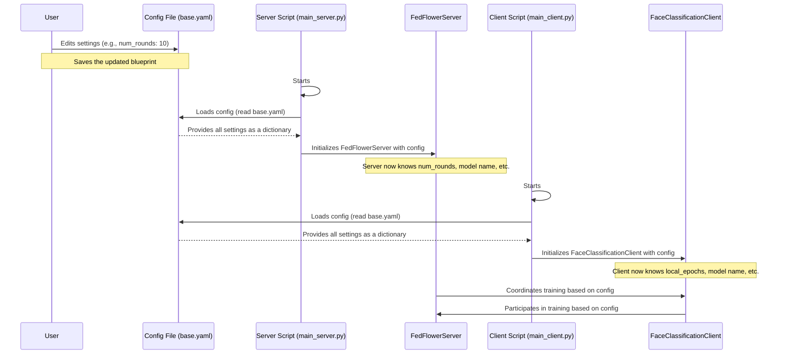

# Chapter 1: Configuration System

Welcome to the exciting world of `FedFace`! In this first chapter, we're going to uncover one of the most powerful and beginner-friendly concepts in our project: the **Configuration System**.

## The Project's Master Blueprint

Imagine you're building a complex machine, like a sophisticated robot. Before you even start, you need a detailed instruction manual or a "master blueprint" that tells you:
*   How many steps the robot should take (e.g., training rounds).
*   What kind of brain the robot should use (e.g., which AI model).
*   How fast it should learn new things (e.g., the learning rate).
*   How it should handle information (e.g., data path).

In `FedFace`, our **Configuration System** is exactly that master blueprint. It's a special file that holds *all* the crucial settings and instructions for how our federated learning project should run.

### Why is this important? The Problem It Solves

Let's say you want to try an experiment: you want your `FedFace` project to train for 10 rounds instead of the default 5, or perhaps you want to use a different AI model for face classification. Without a configuration system, you might have to dig deep into different code files and change numbers or names directly. This is tedious, error-prone, and makes it hard to keep track of your changes.

The Configuration System solves this by giving you **one central place** to change all these settings. You don't touch the core code! You just update the instructions in this blueprint, and the entire `FedFace` project (both the server and all the clients) will follow your new instructions.

## How It Works: The `base.yaml` File

In `FedFace`, our master blueprint is a file called `base.yaml`. You'll find it in `src/use_cases/face_detection/configs/base.yaml`. The `.yaml` part means it's written in YAML, which is a human-friendly data format, much like writing a simple shopping list.

Let's look at a simplified example of what's inside:

```yaml
# Server Configuration
num_rounds: 5
min_clients: 2

# Training Configuration
local_epochs: 3
learning_rate: 0.01

# Model Configuration
model:
  name: "resnet"
  num_classes: 100
```

Each line here is a setting. For instance:
*   `num_rounds: 5`: Tells the **server** to perform 5 rounds of training.
*   `local_epochs: 3`: Tells each **client** to train for 3 local epochs in each round.
*   `model: name: "resnet"`: Specifies that we should use the "resnet" AI model.

By changing these values in `base.yaml`, you can completely alter how `FedFace` operates without touching a single line of Python code!

## Using the Configuration System: A Practical Example

Let's say you want to:
1.  Increase the number of training rounds to `10`.
2.  Change the AI model from `resnet` to `cnn`.

Here's how you'd do it:

**Step 1: Open the `base.yaml` file.**

Navigate to `src/use_cases/face_detection/configs/base.yaml` and open it with any text editor.

**Step 2: Edit the settings.**

Find the lines for `num_rounds` and `model: name` and change their values:

```yaml
# Server Configuration
server_address: "127.0.0.1:9000"
num_rounds: 10              # Changed from 5 to 10
min_clients: 2

# Federated Learning Configuration
strategy: "fedavg"
fraction_fit: 1.0
fraction_evaluate: 1.0

# Client Training Configuration
local_epochs: 3
batch_size: 32
learning_rate: 0.01

# Model Configuration
model:
  name: "cnn"               # Changed from "resnet" to "cnn"
  num_classes: 100

# Data Configuration
data_type: "folder"
dataset_url: "https://github.com/AISeedHub/FedFace/releases/download/data/dataset.zip"
full_data_path: "src/use_cases/face_detection/data/dataset"
distributed_data_path: "src/use_cases/face_detection/distributed_data"
num_clients: 2
non_iid: true
alpha: 0.5
```

**Step 3: Save the file.**

That's it! Now, when you start the `FedFace` server and clients, they will automatically read these new instructions.

**What happens when you run the project?**

When you start the server (using `./src/run_server.bat` or `bash ./src/run_server.sh`), you'll see output like this (simplified):

```
🌸 FedFlower - Face Classification Server
==================================================
🚀 Starting server with 2 clients
📊 Training rounds: 10        # Server now plans for 10 rounds!
🎯 Model: cnn (100 classes)  # Server knows to use the CNN model!
==================================================
```

And similarly, the clients (when you run `./src/run_clients.bat <client_id>`) will also be configured to use the `cnn` model and participate in `10` rounds of training as coordinated by the server. This change required no code modification, only an update to our `base.yaml` blueprint.

## Under the Hood: How the System Reads Your Blueprint

Now, let's peek behind the curtain to see how `FedFace` reads and uses this `base.yaml` file.

### The Flow of Configuration

When you launch the `FedFace` server or a client, here's a simple step-by-step look at what happens:



### Configuration in Code

The magic happens through a simple function that reads the YAML file and turns its contents into a Python dictionary. Both the server and client scripts use this function.

Here's how the `main_server.py` and `main_client.py` files load the configuration:

```python
# From src/use_cases/face_detection/main_server.py
import yaml

def load_config(config_path="src/use_cases/face_detection/configs/base.yaml"):
    """Load configuration from YAML file"""
    with open(config_path, encoding="utf-8") as file:
        config = yaml.safe_load(file) # Reads the YAML and creates a dictionary
    return config

def main():
    print("🌸 FedFlower - Face Classification Server")
    config = load_config() # Load the config here!

    # Create server using settings from the config
    server = FedFlowerServer(
        num_rounds=config["num_rounds"], # Access num_rounds from the config dictionary
        min_clients=config["min_clients"],
        config=config, # Pass the whole config dictionary
    )
    # ... more code ...
```
The `load_config` function opens `base.yaml`, reads its contents, and then `yaml.safe_load(file)` converts all the settings into a Python dictionary, where keys are like `num_rounds` and values are `5` (or `10` if you changed it!). This `config` dictionary is then passed around so different parts of the system can access the settings.

Similarly, the `main_client.py` uses the same `load_config` function:
```python
# From src/use_cases/face_detection/main_client.py
import yaml
# ... other imports ...

def load_config(config_path="src/use_cases/face_detection/configs/base.yaml"):
    """Load configuration from YAML file"""
    with open(config_path, encoding="utf-8") as file:
        config = yaml.safe_load(file)
    return config

def main():
    # ... argument parsing ...
    config = load_config() # Load the config here!

    # Create client using settings from the config
    client = FaceClassificationClient(args.client_id, config) # Pass the config to the client
    # ... more code ...
```

As you can see, both the server and the clients grab their instructions from the same `base.yaml` file. This consistent access to the configuration ensures that both sides of our federated learning system are always on the same page, following the same blueprint.

## Conclusion

The **Configuration System** is your command center for `FedFace`. By mastering how to edit the `base.yaml` file, you gain immense control over the project's behavior, allowing you to experiment with different settings, models, and training strategies without ever altering the core code. It's truly a powerful tool for customization and experimentation!

In the next chapter, we'll dive into the heart of our distributed system: the [Federated Server (FedFlowerServer)](02_federated_server__fedflowerserver__.html), and see how it uses these configuration settings to orchestrate the entire federated learning process.
