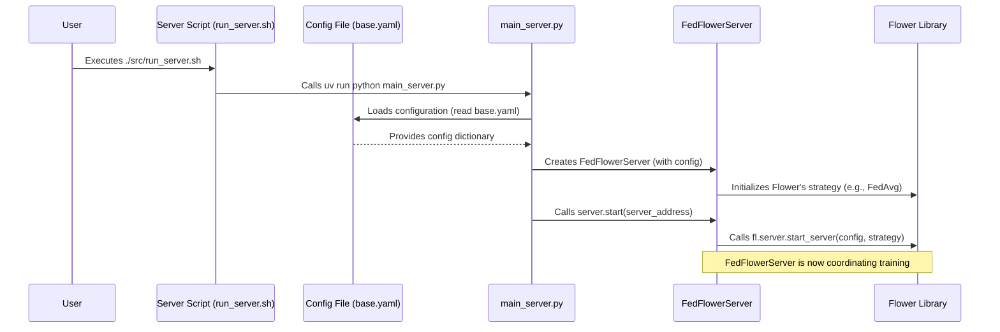

# Chapter 2: Federated Server (FedFlowerServer)

Welcome back, aspiring `FedFace` developers! In our [previous chapter](01_configuration_system_.md), we learned about the **Configuration System**, our project's master blueprint that allows us to easily set up how `FedFace` runs. Now, with our blueprint ready, it's time to meet the central figure who brings that blueprint to life: the **Federated Server**, which we lovingly call `FedFlowerServer`.

## The Classroom Teacher: Orchestrating Collaborative Learning

Imagine a classroom where students want to learn about "face classification." However, there's a catch: each student has their own private notebook (data) that they can't share with anyone else, not even the teacher. How can everyone learn together effectively without sharing private information?

This is where our **Federated Server (FedFlowerServer)** steps in, acting exactly like that smart, organized teacher. The server's main job is to **coordinate** the learning process among all the students (which we call "clients" in federated learning). It ensures that everyone learns from each other's experiences *without ever seeing their private data*.

### Why is this important? The Problem It Solves

In federated learning, data privacy is paramount. We want to train a powerful AI model using data from many different sources (like different users' devices or hospitals), but these sources cannot, or will not, share their raw data.

The `FedFlowerServer` solves this by:
*   Being the central point of contact for all clients.
*   Guiding the entire learning process through several "rounds" of training.
*   Aggregating the *summaries* of learning from clients, not the raw data itself.
*   Distributing an improved, collective understanding back to everyone.

It's the brain behind the operation, making sure all the distributed pieces work together harmoniously to achieve a common goal: building a better face classification model.

## What Does the FedFlowerServer Do?

Let's break down the `FedFlowerServer`'s role, just like a teacher's duties:

| Teacher's Role (Analogy)                   | FedFlowerServer's Role (Technical)               | Explanation                                                              |
| :----------------------------------------- | :----------------------------------------------- | :----------------------------------------------------------------------- |
| **1. Provides the Initial Lesson**         | **Distributes the Global Model**                 | The server sends out the starting version of the AI model to all clients. This is like giving everyone the same textbook to begin. |
| **2. Collects Summarized Learning**        | **Gathers Updated Model Parameters**             | After clients train locally, they send back their *changes* or "updated parameters" (not their data!). The server collects these summaries. |
| **3. Combines Summaries Intelligently**    | **Aggregates Models (e.g., FedAvg)**             | The server takes all the individual client updates and intelligently combines them into one improved global model. It's like the teacher compiling notes from different students into a master study guide. |
| **4. Distributes Improved Understanding**  | **Sends the New Global Model**                   | The newly aggregated, better model is then sent back to all clients for the next round of learning. Everyone gets the updated study guide! |
| **5. Ensures Everyone Learns Together**    | **Coordinates Training Rounds**                  | The server manages the number of training rounds and ensures a minimum number of clients participate in each round.                                              |

This cycle repeats for a specified number of "rounds," making the global model smarter and smarter over time, thanks to the collective effort of all clients.

## How to Start the FedFlowerServer

Starting the `FedFlowerServer` is straightforward, thanks to our [Configuration System](01_configuration_system_.md). You don't need to write any code; you just run a script!

**Step 1: Check Your Blueprint (`base.yaml`)**

Before starting, the server will read its instructions from `src/use_cases/face_detection/configs/base.yaml`. For instance, it knows how many `num_rounds` to train and how many `min_clients` need to be connected from this file.

```yaml
# Server Configuration
server_address: "0.0.0.0:9000"
num_rounds: 5             # Server will coordinate 5 rounds of training
min_clients: 2            # Server will wait for at least 2 clients before starting a round
```

**Step 2: Run the Server Script**

You start the server by executing a simple script:

+   **On Windows:**
    ```bash
    ./src/run_server.bat
    ```
+   **On Linux/GitBash:**
    ```bash
    bash ./src/run_server.sh
    ```

**What happens when you run it? (Expected Output)**

The script first helps prepare and distribute the data for clients (we'll cover this in [Chapter 4: Data Management and Distribution](04_data_management_and_distribution_.md)). After that, it asks for your confirmation and then starts the `FedFlowerServer`. You'll see output similar to this:

```
🌸 FedFlower - Face Classification Server
==================================================
🚀 Starting server with 2 clients
📊 Training rounds: 5        # Server plans for 5 rounds!
🎯 Model: simple_cnn (10 classes)
==================================================
🌸 Starting FedFlower Server on 0.0.0.0:9000
📊 Rounds: 5 | Min Clients: 2
INFO :      Starting Flower server, config: num_rounds=5, no round_timeout
INFO :      Flower ECE: gRPC server running (5 rounds), SSL is disabled
INFO :      [INIT]
INFO :      Requesting initial parameters from one random client
# ... Server waits for clients to connect and then starts training rounds ...
```

As you can see, the server announces its role, its address, the number of rounds, and the minimum clients it needs – all pulled directly from our `base.yaml` [Configuration System](01_configuration_system_.md)!

## Under the Hood: How the Server Works Its Magic

Let's peek behind the curtains to see how the `FedFlowerServer` is initialized and starts its coordination role.

### The Server's Startup Flow

When you run the `run_server.sh` (or `.bat`) script, here’s a simplified sequence of events:



This diagram shows that your command first triggers the `main_server.py` script. This script then loads all the settings from `base.yaml` and uses them to create and start the `FedFlowerServer`. The `FedFlowerServer` itself uses the `Flower Library` (a powerful framework for federated learning) to handle the complex communication and aggregation logic.

### Server Implementation in Code

Let's look at the key parts of the code that make this happen.

First, the `main_server.py` script:

```python
# From src/use_cases/face_detection/main_server.py

# ... (imports and load_config function) ...

from src.fed_core.fed_server import FedFlowerServer # Import our custom server

def main():
    print("🌸 FedFlower - Face Classification Server")
    config = load_config() # 1. Load the blueprint from base.yaml

    # 2. Create an instance of our FedFlowerServer
    server = FedFlowerServer(
        num_rounds=config["num_rounds"], # Pass settings from config
        min_clients=config["min_clients"],
        config=config, # Pass the whole config for other uses
    )

    # ... (print statements) ...

    # 3. Start the server!
    server.start(config["server_address"])

if __name__ == "__main__":
    main()
```

1.  The `main` function starts by loading the configuration from `base.yaml` into a Python dictionary, just like we saw in the [previous chapter](01_configuration_system_.md).
2.  Then, it creates an object of our `FedFlowerServer` class. Notice how it passes values like `num_rounds` and `min_clients` directly from the loaded `config` dictionary. This means the server is set up exactly as defined in your blueprint!
3.  Finally, it calls `server.start()` to kick off the federated learning process.

Now, let's look at a simplified version of the `FedFlowerServer` class itself, found in `src/fed_core/fed_server.py`:

```python
# From src/fed_core/fed_server.py
import flwr as fl # We use the Flower library for federated learning

class FedFlowerServer:
    def __init__(
            self,
            num_rounds: int = 3,
            min_clients: int = 2,
            strategy: Optional[fl.server.strategy.Strategy] = None,
            config: Optional[Dict] = None
    ):
        self.num_rounds = num_rounds
        self.min_clients = min_clients
        self.config = config or {}

        # If no specific strategy is provided, use FedAvg (Federated Averaging)
        if strategy is None:
            strategy = fl.server.strategy.FedAvg(
                fraction_fit=1.0,
                fraction_evaluate=1.0,
                min_fit_clients=min_clients,
                min_evaluate_clients=min_clients,
                min_available_clients=min_clients,
                # ... (other strategy configurations like aggregation functions) ...
            )
        self.strategy = strategy

    def start(self, server_address: str = "0.0.0.0:9000"):
        """Start the Federated Learning server."""
        print(f"🌸 Starting FedFlower Server on {server_address}")
        # This is the core line: starts the Flower server!
        fl.server.start_server(
            server_address=server_address,
            config=fl.server.ServerConfig(num_rounds=self.num_rounds),
            strategy=self.strategy,
        )
```

1.  **`__init__` Method**: When `FedFlowerServer` is created, it takes `num_rounds`, `min_clients`, and the entire `config` dictionary. It also sets up a `strategy`. A "strategy" tells the server *how* to combine the model updates from clients. `FedAvg` (Federated Averaging) is a very common and effective strategy, used as the default here. It essentially averages the model parameters received from clients.
2.  **`start` Method**: This method is where the real magic happens. It calls `fl.server.start_server()`, which is a function from the `Flower` library. This function uses the `server_address`, `num_rounds`, and the chosen `strategy` to set up and run the actual federated learning server, ready to communicate with clients.

## Conclusion

The **Federated Server (FedFlowerServer)** is the central coordinator of our `FedFace` project. It acts like a teacher, orchestrating the entire federated learning process by distributing the global model, collecting local updates, aggregating them, and sending back an improved model – all without ever accessing private client data. You now know how to start it and have a basic understanding of how it leverages the [Configuration System](01_configuration_system_.md) and the `Flower` library to do its job.

Next, we'll turn our attention to the students in this collaborative learning environment: the [Federated Client (FedFlowerClient)](03_federated_client__fedflowerclient__.html). We'll discover how they receive instructions, train locally, and send their learning summaries back to the server.
