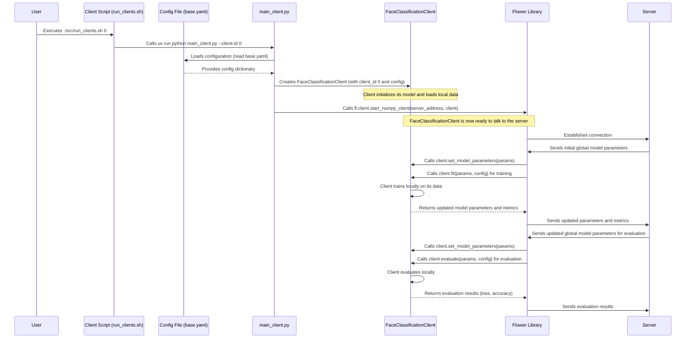

# Chapter 3: Federated Client (FedFlowerClient)

Welcome back, `FedFace` enthusiasts! In our [previous chapter](02_federated_server__fedflowerserver__.md), we met the **Federated Server (FedFlowerServer)**, our project's central coordinator, acting like a teacher guiding a class. Now, it's time to introduce the active learners in this collaborative classroom: the **Federated Client**, which we call `FedFlowerClient`.

## The Individual Student: Learning Privately, Contributing Collectively

Imagine our large classroom again, but this time, focus on an individual student. Each student has their own unique set of textbooks and notes (private data) on face classification. They want to learn and contribute to the class's overall understanding, but they absolutely cannot share their personal textbooks with anyone, not even the teacher.

The **Federated Client (FedFlowerClient)** is exactly like that diligent student. It's a key component in `FedFace` responsible for:
*   **Learning Locally:** Training an AI model using its own private data, right on its device.
*   **Updating Its Understanding:** Refining the model based on what it learns from its local data.
*   **Sharing a Summary:** Instead of sharing raw data, it shares a *summary* of its learning (the changes or "parameters" of its model) with the teacher (the server). This summary doesn't reveal any private details from its textbooks.

This allows for powerful, collaborative learning across many clients while strictly keeping each client's sensitive data secure and private at its source.

### Why is this important? The Problem It Solves

In the real world, data is often scattered across many devices or organizations, and it's frequently private or sensitive. For example, a hospital might have patient face data, but it can't share it due to privacy regulations. Individual users' phones collect face data for unlock features, but they won't upload it to a central server.

The `FedFlowerClient` solves this by enabling each "student" (device, organization) to leverage its own private data to improve a shared AI model. It does this without ever centralizing the raw data, thereby protecting privacy and adhering to regulations. Each client contributes to the global intelligence while safeguarding its unique insights.

## What Does the FedFlowerClient Do?

Let's break down the `FedFlowerClient`'s role, mirroring the actions of a student in our federated learning classroom:

| Student's Role (Analogy)                   | FedFlowerClient's Role (Technical)               | Explanation                                                              |
| :----------------------------------------- | :----------------------------------------------- | :----------------------------------------------------------------------- |
| **1. Receives the Initial Assignment**     | **Gets the Global Model Parameters**             | The server sends the current version of the AI model to the client. This is the starting point for the client's local learning. |
| **2. Studies Locally**                     | **Trains on Local Data**                         | The client uses its own private dataset to train the model. It updates the model's "understanding" based on its unique examples. |
| **3. Prepares a Summary of Learning**      | **Extracts Updated Model Parameters**            | After training, the client doesn't send its data. Instead, it packages the *changes* or new state of its model as a set of parameters. |
| **4. Submits the Summary**                 | **Sends Parameters to the Server**               | The client sends these updated parameters back to the server. This is its contribution to the collective learning. |
| **5. Takes a Test**                        | **Evaluates Local Model Performance**            | The client can also evaluate the model's performance on its local test data, providing feedback on its accuracy and loss. |

This process happens repeatedly for many "rounds" (as configured in our [Configuration System](01_configuration_system_.md)), allowing the global model to continuously improve through the decentralized contributions of all clients.

## How to Start a FedFlowerClient

Just like starting the server, getting a `FedFlowerClient` up and running is simple, thanks to our [Configuration System](01_configuration_system_.md). You run a script and specify which client it is!

**Step 1: Check Your Blueprint (`base.yaml`)**

Before starting, the client will read its instructions from `src/use_cases/face_detection/configs/base.yaml`. For example, it needs to know how many `local_epochs` to train for in each round and which `model: name` to use.

```yaml
# Client Training Configuration
local_epochs: 3           # Each client trains for 3 local epochs in a round
batch_size: 32
learning_rate: 0.01

# Model Configuration
model:
  name: "cnn"             # Client will use the "cnn" model architecture
  num_classes: 100
```

**Step 2: Run the Client Script**

You start a client by executing a simple script, providing a unique `client_id` for each one (e.g., `0`, `1`, `2`, etc.). Each client needs its own separate terminal window.

+   **On Windows (for client 0):**
    ```bash
    ./src/run_clients.bat 0
    ```
+   **On Linux/GitBash (for client 0):**
    ```bash
    bash ./src/run_clients.sh 0
    ```

If you have multiple clients (e.g., `num_clients: 2` in `base.yaml`), you'd open another terminal and run for client 1:

+   **On Windows (for client 1):**
    ```bash
    ./src/run_clients.bat 1
    ```
+   **On Linux/GitBash (for client 1):**
    ```bash
    bash ./src/run_clients.sh 1
    ```

**What happens when you run it? (Expected Output)**

The script will launch the client. It will connect to the server (which you should have started first, as learned in [Chapter 2: Federated Server (FedFlowerServer)](02_federated_server__fedflowerserver__.md)) and then begin participating in the federated learning rounds. You'll see output similar to this:

```
🌸 FedFlower - Face Classification Client 0
==================================================
[Client 0] Initialized with 640 training samples
🚀 Connecting to server at 127.0.0.1:9000
==================================================
INFO :      Received: get_parameters message a3eaf6ed-06f5-4eb0-94cc-04ccca828e28
INFO :      Sent reply
INFO :      Received: train message 5758d188-f4fb-4dce-981c-3e141a89203d
[Client 0] Starting training round...
[Client 0] Epoch 1/3, Loss: 1.7948
[Client 0] Epoch 2/3, Loss: 1.0733
[Client 0] Epoch 3/3, Loss: 0.8521
[Client 0] Training completed - Loss: 1.2399, Accuracy: 65.23%
INFO :      Sent reply
INFO :      Received: evaluate message d2c9b4e7-a1b0-4f5c-8e6d-7f9a1b2c3d4e
[Client 0] Evaluating...
[Client 0] Evaluation - Loss: 0.7038, Accuracy: 72.50%
INFO :      Sent reply
# ... This cycle repeats for multiple rounds ...
```

This output shows Client 0 connecting, receiving instructions from the server, training for `3` local epochs (as per `local_epochs` in `base.yaml`), reporting its training progress, evaluating, and then sending its summary back to the server.

## Under the Hood: How the Client Works Its Magic

Let's peek behind the curtains to see how the `FedFlowerClient` is initialized and participates in the federated learning process.

### The Client's Startup and Interaction Flow

When you run the `run_clients.sh` (or `.bat`) script, here’s a simplified sequence of events:



This diagram illustrates that your command first triggers `main_client.py`. This script loads the configuration, creates our custom `FaceClassificationClient`, and then uses the `Flower` library to connect to the server. Once connected, the client enters a loop of receiving models, training, evaluating, and sending summaries, all coordinated by the server.

### Client Implementation in Code

Let's look at the key parts of the code that make the `FedFlowerClient` function.

First, the `main_client.py` script:

```python
# From src/use_cases/face_detection/main_client.py

# ... (imports and load_config function) ...

from src.fed_core.fed_client import FedFlowerClient # Base client interface
# ... specific model and data loaders ...

class FaceClassificationClient(FedFlowerClient):
    # ... (implementation details below) ...

def main():
    """Start federated learning client"""
    parser = argparse.ArgumentParser(description="Face Classification Federated Client")
    parser.add_argument("--client-id", type=int, required=True)
    parser.add_argument("--server-address", type=str, default="127.0.0.1:9000")
    args = parser.parse_args()

    print(f"🌸 FedFlower - Face Classification Client {args.client_id}")
    config = load_config() # 1. Load the blueprint from base.yaml

    # 2. Create an instance of our FaceClassificationClient
    client = FaceClassificationClient(args.client_id, config)

    print(f"🚀 Connecting to server at {args.server_address}")

    # 3. Start the client! This connects to the Flower server
    fl.client.start_numpy_client(server_address=args.server_address, client=client)

if __name__ == "__main__":
    main()
```

1.  The `main` function first loads the configuration from `base.yaml`.
2.  It then creates an instance of `FaceClassificationClient`, passing the `client_id` and the `config` dictionary. This sets up the client with its specific model and local data.
3.  Finally, `fl.client.start_numpy_client()` is called. This is the `Flower` library function that connects our client to the server and handles all the communication, calling the appropriate methods on our `client` object.

Now, let's look at the `FedFlowerClient` base class in `src/fed_core/fed_client.py`. This class defines the essential methods that *any* `FedFlowerClient` must implement to work with the `Flower` framework:

```python
# From src/fed_core/fed_client.py
import flwr as fl # We use the Flower library for federated learning
from abc import ABC, abstractmethod # For abstract methods

class FedFlowerClient(fl.client.NumPyClient, ABC):
    """
    Base Federated Learning Client.
    Task-specific repos should inherit this class.
    """
    def __init__(self, client_id: int, config: Dict):
        self.client_id = client_id
        self.config = config

    @abstractmethod
    def train_model(self, epochs: int) -> Dict[str, float]:
        """Train model locally. Return training metrics."""
        pass

    # ... (Other abstract methods like evaluate_model, get_model_parameters, set_model_parameters) ...

    # Flower interface implementation
    def fit(self, parameters: List[np.ndarray], config: Dict) -> Tuple[List[np.ndarray], int, Dict]:
        """Flower callback: set params, train model, return updated params."""
        print(f"[Client {self.client_id}] Starting training round...")
        self.set_model_parameters(parameters) # 1. Set model to global params
        epochs = config.get("local_epochs", 1)
        metrics = self.train_model(epochs)   # 2. Train locally (calls abstract method)
        return self.get_model_parameters(), self._get_dataset_size(), metrics # 3. Return updated params

    def evaluate(self, parameters: List[np.ndarray], config: Dict) -> Tuple[float, int, Dict]:
        """Flower callback: set params, evaluate model, return results."""
        print(f"[Client {self.client_id}] Evaluating...")
        self.set_model_parameters(parameters) # 1. Set model to global params
        loss, accuracy, metrics = self.evaluate_model() # 2. Evaluate locally (calls abstract method)
        metrics["accuracy"] = accuracy
        return float(loss), self._get_dataset_size(), metrics # 3. Return evaluation results

    # ... (Other Flower interface methods like get_parameters) ...
```

1.  **`FedFlowerClient` inherits `fl.client.NumPyClient`**: This is crucial. It means our base client can interact directly with the `Flower` framework.
2.  **Abstract Methods**: `train_model`, `evaluate_model`, `get_model_parameters`, `set_model_parameters`, `_get_dataset_size` are defined as `abstractmethod`. This means any class inheriting `FedFlowerClient` *must* provide its own concrete implementation for these. This design ensures modularity, allowing different `FedFace` use cases (like face classification) to plug in their specific training logic while conforming to a standard interface.
3.  **`fit` Method**: This is called by the `Flower` server when it wants the client to *train*. It receives the global model parameters, sets them on the client's local model, calls our custom `train_model` (which will contain the actual PyTorch training loop), and then returns the locally updated parameters.
4.  **`evaluate` Method**: This is called by the `Flower` server when it wants the client to *evaluate* the current global model. It sets the parameters, calls our custom `evaluate_model`, and returns the results.

Finally, let's look at the concrete `FaceClassificationClient` class in `src/use_cases/face_detection/main_client.py`. This class fills in the details for face classification:

```python
# From src/use_cases/face_detection/main_client.py

# ... (MODELS and LOADER dictionaries) ...

class FaceClassificationClient(FedFlowerClient):
    """Face Classification Client for Federated Learning"""

    def __init__(self, client_id: int, config: dict):
        super().__init__(client_id, config) # Call base class constructor

        # Initialize specific model (e.g., SimpleCNN, PretrainedResNet)
        self.model = MODELS[config["model"]["name"]](
            num_classes=config["model"]["num_classes"]
        ).to(self.device) # Move model to CPU/GPU

        self.criterion = nn.CrossEntropyLoss()
        self.optimizer = optim.SGD(self.model.parameters(), lr=config["learning_rate"])
        self.train_loader, self.test_loader = self._load_data() # Load client's data

    def _load_data(self):
        """Load client-specific data based on its ID and config."""
        data_path = os.path.join(self.config["distributed_data_path"], f"client_{self.client_id}")
        dataset = LOADER[self.config["data_type"]](data_dir=data_path, split="train")
        # Split into train/test and create DataLoaders
        train_loader = DataLoader(dataset, batch_size=self.config["batch_size"], shuffle=True)
        # ... (test_loader omitted for brevity) ...
        return train_loader, None # Simplified, real code returns both

    def train_model(self, epochs: int) -> dict[str, float]:
        """Implement actual local training loop here using PyTorch."""
        self.model.train() # Set model to training mode
        for epoch in range(epochs):
            for data, target in self.train_loader:
                data, target = data.to(self.device), target.to(self.device)
                self.optimizer.zero_grad()
                output = self.model(data)
                loss = self.criterion(output, target)
                loss.backward()
                self.optimizer.step()
            print(f"[Client {self.client_id}] Epoch {epoch+1}/{epochs}, Loss: {loss.item():.4f}")
        return {"train_loss": loss.item()} # Simplified return

    def evaluate_model(self) -> tuple[float, float, dict]:
        """Implement local evaluation using PyTorch."""
        self.model.eval() # Set model to evaluation mode
        test_loss = 0.0
        correct = 0
        total = 0
        with torch.no_grad():
            for data, target in self.test_loader: # Assuming test_loader exists
                data, target = data.to(self.device), target.to(self.device)
                output = self.model(data)
                test_loss += self.criterion(output, target).item()
                _, predicted = torch.max(output.data, 1)
                total += target.size(0)
                correct += (predicted == target).sum().item()
        accuracy = 100.0 * correct / total
        avg_loss = test_loss / len(self.test_loader)
        return avg_loss, accuracy, {"test_accuracy": accuracy}

    def get_model_parameters(self) -> list[np.ndarray]:
        """Convert PyTorch model parameters to NumPy arrays."""
        return [val.cpu().numpy() for _, val in self.model.state_dict().items()]

    def set_model_parameters(self, parameters: list[np.ndarray]) -> None:
        """Load NumPy arrays into PyTorch model parameters."""
        params_dict = zip(self.model.state_dict().keys(), parameters)
        state_dict = {k: torch.tensor(v) for k, v in params_dict}
        self.model.load_state_dict(state_dict, strict=True)

    def _get_dataset_size(self) -> int:
        """Return size of local training dataset."""
        return len(self.train_loader.dataset)
```

1.  **`__init__`**: The constructor loads the correct model architecture (like `SimpleCNN` or `PretrainedResNet` based on `config["model"]["name"]`), sets up the PyTorch optimizer and loss function, and crucially, calls `_load_data()` to get its own slice of the federated dataset.
2.  **`_load_data`**: This method is responsible for loading the data specific to this client (e.g., from `distributed_data/client_0`). We'll learn more about how data is prepared and distributed in [Chapter 4: Data Management and Distribution](04_data_management_and_distribution_.md).
3.  **`train_model`**: This contains the standard PyTorch training loop, but it only runs for `local_epochs` on the client's private `train_loader`. This is where the client learns from its "textbooks."
4.  **`evaluate_model`**: This contains the standard PyTorch evaluation loop, assessing the model's performance on the client's local `test_loader`.
5.  **`get_model_parameters` and `set_model_parameters`**: These methods are vital for bridging between PyTorch's internal model representation and the NumPy arrays that the `Flower` library uses for communication. When the client receives parameters from the server, `set_model_parameters` updates its local model. When the client sends its updates, `get_model_parameters` converts its PyTorch model's state into a format the server can understand.

## Conclusion

The **Federated Client (FedFlowerClient)** is the distributed worker of `FedFace`, acting like an individual student who learns from their own private data. It trains locally, updates its model, and shares only a summary of its learning with the server, thereby enabling powerful collaborative AI model training while preserving data privacy. You now understand its role, how to launch it, and how it uses the [Configuration System](01_configuration_system_.md) and the `Flower` library to participate in the federated learning process.

Next up, we'll delve deeper into how these clients get their `unique textbooks` in [Chapter 4: Data Management and Distribution](04_data_management_and_distribution_.html), exploring how data is prepared and distributed across multiple clients securely.
