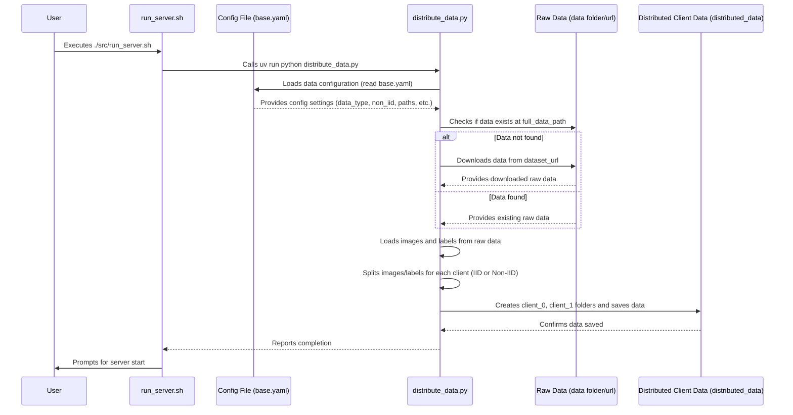

# Chapter 4: Data Management and Distribution

Welcome back, `FedFace` enthusiasts! In our [previous chapter](03_federated_client__fedflowerclient__.md), we explored the **Federated Client**, our project's individual learner who trains on their own private data. But a crucial question remains: How does each client get its unique set of "textbooks" (its private data) in the first place? And how is this data prepared and shared responsibly?

This is where **Data Management and Distribution** steps in. Imagine `FedFace` as a big collaborative cooking project. We have a master chef (the [Federated Server](02_federated_server__fedflowerserver__.md)) who coordinates the meal, and many sous-chefs (the [Federated Clients](03_federated_client__fedflowerclient__.md)) who cook individual dishes. Before anyone can cook, someone needs to gather all the ingredients, prepare them, and then carefully divide them among the sous-chefs. This ensures everyone has what they need, but also respects any dietary restrictions or preferences for how the ingredients are portioned.

Our **Data Management and Distribution** abstraction acts exactly like this ingredient manager. It's responsible for:
*   Getting the raw face image data (the ingredients).
*   Cleaning and preparing it if necessary.
*   Carefully dividing it among different clients, respecting whether the data should be evenly mixed (IID) or more specialized (Non-IID), mimicking real-world data situations.

### Why is this important? The Problem It Solves

In federated learning, data is often sensitive and originates from diverse sources. We can't simply put all raw data into one central pot. For example, some clients might have many images of one person, while others have fewer images of many different people. Or, one client might have data from a specific demographic that another client doesn't.

The Data Management and Distribution system solves this by:
*   **Decentralizing Data Access**: It ensures each client gets its own *local* slice of the dataset, which it never shares.
*   **Simulating Real-World Scenarios**: It allows us to prepare data that is either perfectly mixed (IID) or more realistically uneven (Non-IID), which is common in real-world federated settings.
*   **Streamlining Setup**: It automates the process of data preparation, making it easy to get `FedFace` up and running with diverse data setups.

It's the unsung hero that ensures all clients have the right ingredients to start their local training.

## What Does Data Management and Distribution Do?

Let's break down the core tasks of this data "chef":

| Chef's Task (Analogy)              | Data System's Role (Technical)               | Explanation                                                              |
| :--------------------------------- | :------------------------------------------- | :----------------------------------------------------------------------- |
| **1. Gathering Ingredients**       | **Loading & Downloading Data**               | It can load face images from local folders or pre-processed `.npz` files. If the data isn't there, it can download it from a specified URL. |
| **2. Preparing Ingredients**       | **Data Preparation (if needed)**             | It ensures the data is in a format suitable for distribution. While `FedFace` often uses pre-prepared data, this step sets the stage for any necessary transformations. |
| **3. Portioning Ingredients**      | **Splitting Data for Clients**               | This is the core: dividing the overall dataset into smaller, client-specific datasets.                                                         |
| **4. Choosing Portioning Style**   | **IID vs. Non-IID Distribution**             | You can choose to split data evenly (IID) or unevenly (Non-IID) to simulate different real-world data distributions.                          |
| **5. Storing Portioned Ingredients** | **Saving Client-Specific Datasets**          | Each client's portion is saved in its own dedicated folder, ready for when the client starts training.                                     |

## How to Use It: The Data Distribution Chef

The good news is that `FedFace` automates much of this! You mostly interact with the data management system through the [Configuration System](01_configuration_system_.md) (`base.yaml`) and by running the server script.

### Step 1: Tell the Chef Your Preferences (Configuration)

All instructions for data management are set in our `base.yaml` blueprint (`src/use_cases/face_detection/configs/base.yaml`). Here are the most relevant settings:

```yaml
# Data Configuration
data_type: "folder" # Can be "folder" (raw images) or "npz" (pre-processed arrays)
dataset_url: "https://github.com/AISeedHub/FedFace/releases/download/data/dataset.zip" # URL to download if full_data_path not found
full_data_path: "src/use_cases/face_detection/data/dataset" # Where the full dataset is/will be
distributed_data_path: "src/use_cases/face_detection/distributed_data" # Where client-specific data will be saved
num_clients: 2 # How many clients to split data for
non_iid: true # Set to true for uneven distribution, false for even distribution
alpha: 0.5 # A parameter for Non-IID. Smaller alpha makes distribution more uneven.
```

*   **`data_type`**: Specifies if your raw data is in a folder (containing image files) or an NPZ file (containing NumPy arrays of images and labels).
*   **`dataset_url` & `full_data_path`**: If `FedFace` can't find the dataset at `full_data_path`, it will try to download it from `dataset_url`.
*   **`distributed_data_path`**: This is the *output* folder where all the client-specific data will be stored. Each client will get its own subfolder here (e.g., `distributed_data/client_0`, `distributed_data/client_1`).
*   **`num_clients`**: How many clients you plan to have, so the data can be divided into that many portions.
*   **`non_iid`**: This is crucial!
    *   Set to `false` for **IID** (evenly mixed) distribution. Each client gets a mini-version of the overall dataset, representing all types of face images.
    *   Set to `true` for **Non-IID** (unevenly distributed) data. This mimics real-world scenarios where clients might have more data of specific individuals or categories.
*   **`alpha`**: Only relevant when `non_iid` is `true`. A smaller `alpha` value makes the data distribution *more uneven* across clients, meaning some clients will have a much more focused (and thus less diverse) dataset.

### Step 2: Let the Chef Do Its Work (Running the Server Script)

The best part is that you don't need to run a separate command for data distribution. The `run_server.sh` (or `.bat`) script automatically calls the data distribution utility *before* starting the server! This ensures that when your [Federated Clients](03_federated_client__fedflowerclient__.md) connect, their data is already prepared and waiting for them.

When you run:
+   **On Windows:**
    ```bash
    ./src/run_server.bat
    ```
+   **On Linux/GitBash:**
    ```bash
    bash ./src/run_server.sh
    ```

You'll see output like this, indicating the data distribution process:

```
Distributing data ...
================================================================================
🌸 FedFlower - Face Detection Data Preparation
================================================================================

📥 Step 1: Preparing dataset...
# ... (if data is not found, it will download from dataset_url here) ...
✅ Dataset downloaded and extracted to src/use_cases/face_detection/data/dataset

📤 Step 2: Distributing to 2 clients...

================================================================================
📊 Distributing 1000 images to 2 clients
   Distribution: Non-IID
================================================================================

   Split ratio: 80% - 20%
--------------------------------------------------------------------------------
✓ Client 0:
   - Images:  800 (80.0%)
   - Label distribution: {'0': 80, '1': 720} # Client 0 mostly has label '1'
   - Saved to: src/use_cases/face_detection/distributed_data/client_0
✓ Client 1:
   - Images:  200 (20.0%)
   - Label distribution: {'0': 180, '1': 20} # Client 1 mostly has label '0'
   - Saved to: src/use_cases/face_detection/distributed_data/client_1
--------------------------------------------------------------------------------

✅ Data distribution complete!
📁 Data saved to: src/use_cases/face_detection/distributed_data/

================================================================================
✅ All done! You can now start the federated learning process.
================================================================================
# ... Then the server asks for confirmation to start ...
```

As you can see, the system tells you exactly how many images each client receives and even shows the distribution of labels within each client's dataset. In this `Non-IID` example with an 80-20 split, `Client 0` received 80% of the data with a heavy bias towards label `1`, while `Client 1` received 20% of the data with a bias towards label `0`. This creates a realistic challenge for the federated learning algorithm!

After this, you can check the `src/use_cases/face_detection/distributed_data` folder, and you'll find subfolders like `client_0`, `client_1`, each containing an `data.npz` file (or a folder structure with images, depending on your `data_type` setting).

## Under the Hood: The Chef's Recipe Book

Let's peek behind the curtains to see how this data distribution magic happens.

### The Flow of Data Distribution

When you launch the server script, here’s a simplified sequence of events for data preparation and distribution:



This diagram shows that your server launch command first triggers `distribute_data.py`. This script reads your `base.yaml` file, makes sure the raw data is available (downloading it if necessary), then carefully divides and saves it into separate client folders.

### Data Distribution in Code

The core logic for data management and distribution resides in `src/use_cases/face_detection/utils/distribute_data.py`.

Let's look at the `main` function in `distribute_data.py`:

```python
# Simplified from src/use_cases/face_detection/utils/distribute_data.py
import os
import yaml
import wget # For downloading data
import numpy as np
import shutil

def main():
    # 1. Load data configuration from base.yaml
    with open("src/use_cases/face_detection/configs/base.yaml", encoding="utf-8") as f:
        config = yaml.safe_load(f)

    # 2. Check for dataset existence and download if necessary
    if not os.path.exists(config["full_data_path"]):
        print(f"❌ Dataset not found at {config['full_data_path']}. Downloading...")
        # Simplified: actual code handles zip and folder extraction
        wget.download(config["dataset_url"], os.path.join(config["full_data_path"], "dataset.zip"))
        # ... (unzip logic) ...
        print("✅ Download complete!")

    # 3. Load the full dataset (images and labels)
    images, labels = [], []
    if config["data_type"] == "npz":
        images, labels = load_npz_data(config["full_data_path"])
    elif config["data_type"] == "folder":
        images, labels = load_folder_data(config["full_data_path"])
    # ... other data types

    # 4. Distribute data to clients based on config settings
    distribute_data(
        images=images,
        labels=labels,
        num_clients=config["num_clients"],
        output_path=config["distributed_data_path"],
        non_iid=config["non_iid"],
        alpha=config["alpha"],
        data_type=config["data_type"],
    )

if __name__ == "__main__":
    main()
```
1.  The `main` function first loads all the relevant data configuration settings from `base.yaml`.
2.  It then checks if the full dataset exists at the `full_data_path`. If not, it uses `wget` to download it from the `dataset_url` and extracts it.
3.  Next, it calls either `load_npz_data` or `load_folder_data` (simplified functions shown below) to load the entire dataset into memory.
4.  Finally, it passes all this information to the core `distribute_data` function, which handles the actual splitting and saving.

Now, let's look at the `distribute_data` function itself:

```python
# Simplified from src/use_cases/face_detection/utils/distribute_data.py
def distribute_data(images, labels, num_clients, output_path, non_iid, alpha, data_type):
    num_images = len(images)
    indices = np.arange(num_images)
    np.random.shuffle(indices) # Shuffle all data first

    # Clear old distributed data
    if os.path.exists(output_path):
        shutil.rmtree(output_path)
    os.makedirs(output_path, exist_ok=True)

    client_indices = {}
    if non_iid:
        if num_clients == 2:
            # Simple 80-20 split for 2 clients
            split_point = int(0.8 * num_images)
            client_indices = {0: indices[:split_point], 1: indices[split_point:]}
        else:
            # Use Dirichlet distribution for more clients
            proportions = np.random.dirichlet([alpha] * num_clients)
            # ... (logic to convert proportions to actual indices) ...
    else: # IID: Equal distribution
        split_indices = np.array_split(indices, num_clients)
        client_indices = {i: split for i, split in enumerate(split_indices)}

    # Save data for each client
    for client_id, idx in client_indices.items():
        client_dir = os.path.join(output_path, f"client_{client_id}")
        os.makedirs(client_dir, exist_ok=True)
        client_images = images[idx]
        client_labels = labels[idx]

        if data_type == "npz":
            save_npz_data(client_images, client_labels, client_dir)
        elif data_type == "folder":
            save_folder_data(client_images, client_labels, client_dir)
```
1.  **Shuffling**: The function starts by shuffling the indices of the entire dataset. This is important for both IID and Non-IID distributions to ensure randomness.
2.  **Cleaning**: It removes any old `distributed_data` folders to ensure a clean slate for the new distribution.
3.  **IID vs. Non-IID Logic**:
    *   If `non_iid` is `False`, it uses `np.array_split` to divide the shuffled data indices evenly among clients, creating an **IID** dataset.
    *   If `non_iid` is `True`, for 2 clients, it uses a simple 80-20 split (a common way to simulate Non-IID). For more clients, it uses `np.random.dirichlet` to create proportions, which results in an **uneven (Non-IID)** distribution where clients might have more data of certain types.
4.  **Saving Client Data**: For each client, it creates a dedicated folder (`client_0`, `client_1`, etc.) within `distributed_data_path` and saves the client-specific images and labels using helper functions like `save_npz_data` or `save_folder_data`.

Finally, here are the simplified helper functions for loading and saving data:

```python
# Simplified from src/use_cases/face_detection/utils/distribute_data.py
def load_npz_data(npz_path):
    """Load images and labels from npz file"""
    data = np.load(npz_path)
    return data["images"], data["labels"]

def save_npz_data(images, labels, save_path):
    """Save images and labels to npz file"""
    np.savez_compressed(
        os.path.join(save_path, "data.npz"),
        images=images,
        labels=labels,
    )

def load_folder_data(folder_path):
    """Load image paths and labels from folder structure"""
    images = []
    labels = []
    # Simplified: actual code iterates through identity folders and image files
    # ...
    return np.array(images), np.array(labels) # Returns paths to images, not actual image data

def save_folder_data(images, labels, save_path):
    """Save images to folder structure (by copying files)"""
    # Simplified: actual code copies images to respective label folders
    # ...
    pass
```
These functions abstract away the details of reading from `.npz` files or iterating through image folders, making the `distribute_data` function cleaner and focused on the splitting logic.

## Conclusion

The **Data Management and Distribution** system is `FedFace`'s ingredient manager, ensuring that each [Federated Client](03_federated_client__fedflowerclient__.html) receives its own unique and private slice of the overall dataset. By configuring `base.yaml`, you can control whether data is downloaded, how it's loaded, and whether it's distributed evenly (IID) or unevenly (Non-IID), perfectly simulating real-world federated learning challenges. This automated process sets the stage for the collaborative learning to begin.

Now that our clients have their carefully portioned datasets, we can finally dive into *what* they actually learn! In the next chapter, we'll explore the [Face Classification Logic](05_face_classification_logic_.html) itself, understanding how the clients train their AI models to recognize faces.

