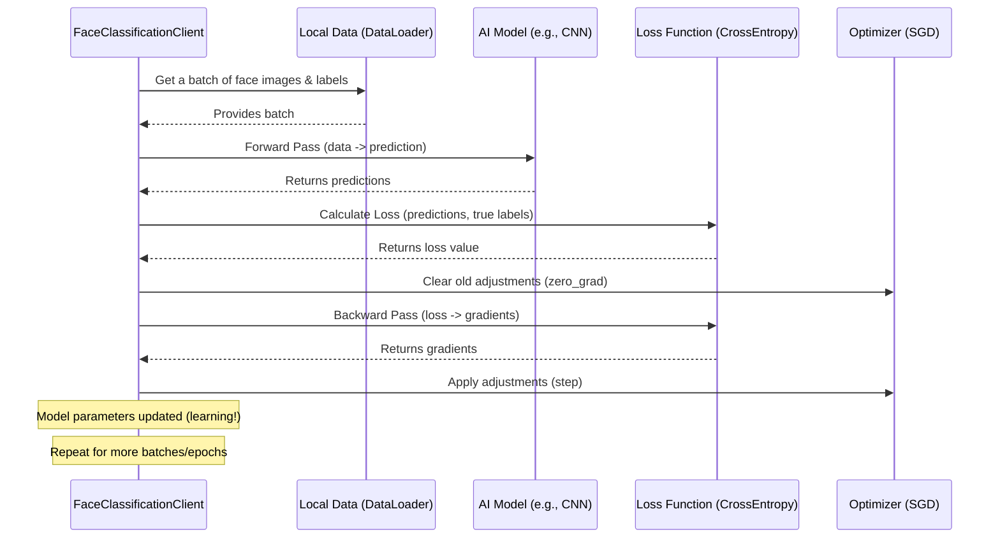

# Chapter 5: Face Classification Logic

Welcome back, `FedFace` developers! In our [previous chapter](04_data_management_and_distribution_.md), we learned how each individual client gets its own unique set of "textbooks" – its private slice of the face dataset. Now that our clients have their carefully portioned ingredients, the big question is: **What do they *do* with them?**

This is where **Face Classification Logic** comes in. Imagine you're teaching a young child to recognize different animals. You show them a picture of a cat, say "cat," and if they say "dog," you gently correct them. Over time, they get better at distinguishing cats from dogs.

In `FedFace`, our **Face Classification Logic** is the specific "recipe" or set of instructions that both our individual clients and the optional centralized training use to teach an AI model how to recognize faces. It's the core "learning brain" that knows:
*   How to look at a face image and make a guess (e.g., "This is person A").
*   How to figure out if that guess was right or wrong.
*   How to adjust the model's "brain" to make better guesses next time.

### Why is this important? The Problem It Solves

Teaching a computer to recognize faces is a complex task. It's not enough to just give it pictures; you need a structured way for it to learn. Without a clear "recipe," the model wouldn't know how to turn pixels into a prediction, how to measure its mistakes, or how to improve.

The Face Classification Logic solves this by providing:
*   **A Standardized Learning Process:** All clients (and centralized training) follow the same fundamental steps, ensuring consistent learning.
*   **Performance Measurement:** It defines how we calculate "how good" the model is (e.g., its accuracy) and "how wrong" it is (its loss), which are crucial for tracking progress.
*   **Adaptation Mechanism:** It includes the specific rules for how the model learns from its errors and adjusts its internal settings to become smarter.

This logic is the intellectual core of `FedFace`, enabling the system to actually *do* face classification, whether collaboratively in a federated setting or individually in a centralized one.

## What Does Face Classification Logic Do?

Let's break down the essential steps of this "learning recipe":

| Learning Step (Analogy)              | Face Classification Logic (Technical)          | Explanation                                                              |
| :----------------------------------- | :--------------------------------------------- | :----------------------------------------------------------------------- |
| **1. Look & Guess**                  | **Forward Pass (Prediction)**                  | The model takes an input face image and processes it to output a prediction, like a probability for each person it might be. |
| **2. Check the Answer**              | **Loss Calculation (Criterion)**               | This step compares the model's guess to the *true* answer (the correct person's identity). It then calculates a "loss" value, which is a number telling us how far off the guess was. A lower loss means a better guess. |
| **3. Figure Out What Went Wrong**    | **Backward Pass (Gradient Calculation)**       | Based on the loss, the system figures out exactly how each part of the model contributed to the error. This is like tracing back how a wrong turn was made. |
| **4. Learn & Adjust**                | **Optimizer Step (Parameter Update)**          | Using the information from the "backward pass," the model's internal settings (its parameters) are slightly adjusted to reduce the loss for next time. This is how the model "learns." |
| **5. Take a Test**                   | **Evaluation (Accuracy & Test Loss)**          | Periodically, the model is tested on unseen data to measure its overall performance, usually with accuracy (percentage of correct guesses) and average test loss. |

These steps (1-4) are repeated many, many times in what's called a **training loop**, helping the model continuously refine its ability to classify faces. Step 5 typically happens less frequently to check overall progress.

## How to Use Face Classification Logic

The great news is that you don't directly "call" these logic steps like separate commands. Instead, this logic is already built right into the `FedFace` components that perform training:

1.  **Federated Clients (`FaceClassificationClient`):** Each client ([Chapter 3: Federated Client](03_federated_client__fedflowerclient__.md)) uses this logic to train its local model on its private data during each round of federated learning.
2.  **Centralized Training (`FaceClassification`):** For comparison or simpler experiments, `FedFace` also provides a way to train a model centrally (all data on one machine). This centralized training uses the *same* classification logic.

You control *how* this logic behaves through the [Configuration System](01_configuration_system_.md) in your `base.yaml` file:

```yaml
# Client Training Configuration (or Centralized Training)
local_epochs: 3          # How many times the model repeats steps 1-4 on its data
batch_size: 32           # How many images the model looks at before adjusting (step 4)
learning_rate: 0.01      # How big the adjustments are in step 4

# Model Configuration (What kind of 'brain' to use, more in next chapter!)
model:
  name: "cnn"
  num_classes: 100
```

By changing these values (e.g., `local_epochs`, `learning_rate`), you're essentially adjusting how aggressively or patiently your model learns, but the core "recipe" (the logic steps) remains the same.

### Practical Example (What happens when you run a client or centralized training)

When you run a client (e.g., `python src/use_cases/face_detection/main_client.py --client-id 0`) or the centralized training script (`python src/use_cases/face_detection/central_run.py`), you'll see output that directly reflects this classification logic in action:

```
[Client 0] Initialized with 640 training samples
[Client 0] Epoch 1/3, Loss: 1.7948   # Model looked at data, calculated loss (step 1-4)
[Client 0] Epoch 2/3, Loss: 1.0733   # Loss improved! Model is learning
[Client 0] Epoch 3/3, Loss: 0.8521   # Loss improved further
[Client 0] Training completed - Loss: 1.2399, Accuracy: 65.23% # Overall training summary
[Client 0] Evaluating...             # Model is taking a test (step 5)
[Client 0] Evaluation - Loss: 0.7038, Accuracy: 72.50% # Test results
```
This output clearly shows the training steps (epochs, loss) and the evaluation step (accuracy, test loss), all driven by the Face Classification Logic.

## Under the Hood: The Recipe Book

Let's peek into the code that implements this core Face Classification Logic. It's largely shared between the `FaceClassificationClient` (`src/use_cases/face_detection/main_client.py`) and the `FaceClassification` class for centralized training (`src/use_cases/face_detection/central_run.py`).

### The Logic Flow During Training

Here's a simplified sequence of events for how one client (or the centralized trainer) executes the face classification logic:



This diagram shows the core cycle: get data, make a guess, calculate error, and adjust the model.

### Code Implementation of the Logic

The `FaceClassificationClient` (and `FaceClassification` for centralized training) sets up the model, loss function, and optimizer in its `__init__` method, then implements the training and evaluation loops in `train_model` and `evaluate_model`.

Let's look at the `__init__` method:

```python
# Simplified from src/use_cases/face_detection/main_client.py (and central_run.py)
import torch.nn as nn
import torch.optim as optim
import torch

class FaceClassificationClient: # Or FaceClassification
    def __init__(self, client_id: int, config: dict):
        # ... (super().__init__ and device setup) ...

        # 1. Initialize the AI Model (e.g., SimpleCNN, will cover in next chapter)
        self.model = MODELS[config["model"]["name"]](
            num_classes=config["model"]["num_classes"]
        ).to(self.device)

        # 2. Define the Loss Function (how to measure 'wrongness')
        self.criterion = nn.CrossEntropyLoss() # Perfect for classification tasks

        # 3. Define the Optimizer (how to adjust the model's brain)
        self.optimizer = optim.SGD(
            self.model.parameters(), lr=config["learning_rate"], momentum=0.9
        )

        # ... (data loading: self.train_loader, self.test_loader) ...
```
Here:
1.  `self.model`: This line loads the specific AI model architecture (like a CNN or ResNet) specified in your `base.yaml`. We'll explore these different "brains" in [Chapter 6: Pluggable Model Architecture](06_pluggable_model_architecture_.md).
2.  `self.criterion`: This defines the `CrossEntropyLoss` function. It's a standard way to calculate the "wrongness" for classification tasks. It compares the model's predicted probabilities with the actual label.
3.  `self.optimizer`: This sets up the `Stochastic Gradient Descent (SGD)` optimizer. This is the mechanism that takes the "wrongness" information and adjusts the model's internal parameters (weights and biases) to improve its performance in the next step. `lr` (learning rate) controls how big these adjustments are.

Next, let's examine the `train_model` method, which contains the core learning loop:

```python
# Simplified from src/use_cases/face_detection/main_client.py (and central_run.py)
class FaceClassificationClient: # Or FaceClassification
    # ... (init and other methods) ...

    def train_model(self, epochs: int) -> dict[str, float]:
        self.model.train() # Tell model we are in training mode
        for epoch in range(epochs): # Loop for each 'local_epoch'
            for batch_idx, (data, target) in enumerate(self.train_loader):
                data, target = data.to(self.device), target.to(self.device)

                self.optimizer.zero_grad() # Clear previous adjustments (step 3 - part 1)
                output = self.model(data)   # Step 1: Forward Pass (make a guess)
                loss = self.criterion(output, target) # Step 2: Calculate Loss
                loss.backward()             # Step 3: Backward Pass (figure out errors)
                self.optimizer.step()       # Step 4: Adjust the model (learn!)

            print(f"[Client {self.client_id}] Epoch {epoch+1}/{epochs}, Loss: {loss.item():.4f}")
        return {"train_loss": loss.item()}
```
This `train_model` method is the heart of the learning process. It iterates for the specified number of `epochs` (from `base.yaml`), and within each epoch, it processes data in `batches` (also from `base.yaml`). The four critical lines (marked with comments) directly implement the forward pass, loss calculation, backward pass, and optimizer step, forming the core of the face classification logic.

Finally, the `evaluate_model` method implements the testing phase:

```python
# Simplified from src/use_cases/face_detection/main_client.py (and central_run.py)
class FaceClassificationClient: # Or FaceClassification
    # ... (init and other methods) ...

    def evaluate_model(self) -> tuple[float, float, dict]:
        self.model.eval() # Tell model we are in evaluation mode
        test_loss = 0.0
        correct = 0
        total = 0

        with torch.no_grad(): # No need to adjust model during evaluation
            for data, target in self.test_loader:
                data, target = data.to(self.device), target.to(self.device)
                output = self.model(data)
                test_loss += self.criterion(output, target).item() # Calculate loss
                _, predicted = torch.max(output.data, 1) # Find the model's highest probability guess
                total += target.size(0)
                correct += (predicted == target).sum().item() # Count correct guesses

        accuracy = 100.0 * correct / total
        avg_loss = test_loss / len(self.test_loader)
        print(f"[Client {self.client_id}] Evaluation - Loss: {avg_loss:.4f}, Accuracy: {accuracy:.2f}%")
        return avg_loss, accuracy, {"test_accuracy": accuracy}
```
The `evaluate_model` method focuses on assessing performance. It runs through the `test_loader` (unseen data), calculates the `test_loss`, and, importantly, determines the `accuracy` by comparing the model's predictions to the true labels. `torch.no_grad()` is used to ensure no learning happens during this testing phase.

As you can see, the core classification logic is robustly implemented within these methods, making `FedFace` capable of learning to recognize faces effectively.

## Conclusion

The **Face Classification Logic** is the beating heart of `FedFace`, defining the precise "recipe" for how AI models learn to classify faces. It encompasses the crucial steps of making predictions, measuring errors with a loss function, adjusting model parameters using an optimizer, and evaluating overall performance. This standardized logic is used by both individual [Federated Clients](03_federated_client__fedflowerclient__.md) and during centralized training, ensuring consistent and effective learning across the project.

Now that we understand *how* the models learn, in the next chapter, we'll dive into *what kind of "brains"* these models actually are. We'll explore the [Pluggable Model Architecture](06_pluggable_model_architecture_.html), looking at different AI models like CNNs and ResNets that power `FedFace`.
