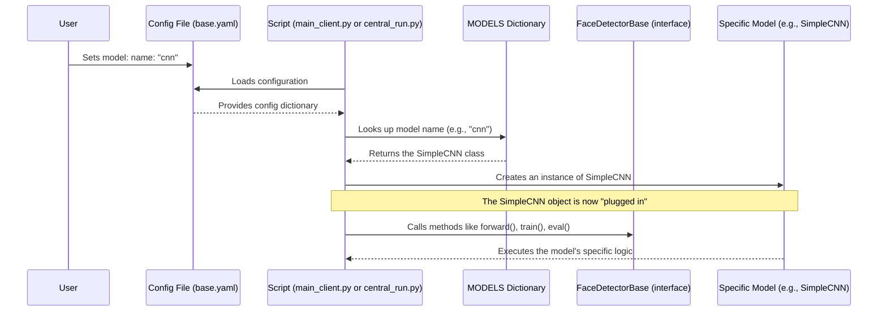

# Chapter 6: Pluggable Model Architecture

Welcome back, `FedFace` developers! In our [previous chapter](05_face_classification_logic_.md), we explored the **Face Classification Logic**, the specific "recipe" that guides our AI models in learning to recognize faces. We saw *how* models learn, but we touched only briefly on *what kind of "brain"* they actually use.

This is where the concept of **Pluggable Model Architecture** comes in. Imagine your smart home has standardized electrical outlets. You don't need a different electrician for every new appliance. You can just plug in a new lamp, a coffee maker, or a TV, as long as they fit the same socket. You swap them in and out easily, and the house's electrical system continues to work seamlessly.

In `FedFace`, our **Pluggable Model Architecture** is exactly like these standardized electrical outlets. It allows you to "plug in" different AI models (like a simple CNN, an MLP, or a more advanced ResNet) for face classification. As long as these models "fit the socket" (meaning they follow a common set of rules or an "interface"), you can easily swap them out or add new ones without having to rewrite the core federated learning logic.

### Why is this important? The Problem It Solves

AI research is constantly evolving, with new and improved models appearing all the time. In `FedFace`, we want to be flexible. What if you start with a simple model but later want to experiment with a more powerful one to achieve better accuracy? Or perhaps you want to compare how different models perform in a federated setting?

Without a pluggable architecture, changing the model would be a headache. You'd likely have to:
*   Edit multiple parts of the client and server code.
*   Risk breaking other functionalities.
*   Spend a lot of time just on integrating the new model, instead of focusing on actual experimentation.

The Pluggable Model Architecture solves this by:
*   **Enabling Easy Experimentation:** You can quickly try out different AI models without major code changes.
*   **Promoting Reusability:** Models are designed to be independent, making them easy to reuse across different parts of the project or even other projects.
*   **Ensuring Flexibility:** `FedFace` remains adaptable to future advancements in AI model design, extending its lifespan and utility.

It decouples the *type* of AI model from the *process* of federated learning, making the system much more robust and versatile.

## What Does Pluggable Model Architecture Do?

Let's break down the core components that make models "pluggable":

| Electrical Outlet (Analogy)               | Pluggable Model (Technical)             | Explanation                                                              |
| :---------------------------------------- | :-------------------------------------- | :----------------------------------------------------------------------- |
| **1. The Standardized Socket**            | **Base Model Interface (e.g., `FaceDetectorBase`)** | This is a blueprint (a base class) that all "pluggable" AI models must follow. It defines common methods (like `forward()`) that the system expects. |
| **2. Different Appliances**               | **Specific AI Models (e.g., `SimpleCNN`, `MLP`, `PretrainedResNet`)** | These are the actual AI models. They are built to fit the `FaceDetectorBase` interface, meaning they implement all the required methods. |
| **3. The "Model Selector" Dial**          | **Model Dictionary (`MODELS`)**         | This is a central list or dictionary where all available pluggable models are registered. When the system needs a model, it looks it up by name here. |
| **4. Plugging in the Appliance**          | **Instantiating Model by Name**         | The system reads the desired model's name from the configuration and uses the `MODELS` dictionary to create an instance of that specific AI model. |

This design allows the core `FedFace` logic (server, client, data handling) to remain generic, working with *any* model that fits the `FaceDetectorBase` interface, without needing to know the internal details of each specific model.

## How to Use It: Swapping Your AI Brain

Using the pluggable model architecture is incredibly simple, thanks to our [Configuration System](01_configuration_system_.md). You only need to change one line in your `base.yaml` file!

### Step 1: Tell `FedFace` Which Brain to Use (Configuration)

The central place to select your model is in `src/use_cases/face_detection/configs/base.yaml`. Look for the `model` section:

```yaml
# Model Configuration
model:
  name: "cnn" # This is the line to change!
  num_classes: 100
```

To switch models, you simply change the value of `model: name` to one of the available options:
*   `"cnn"`: Uses a simple Convolutional Neural Network.
*   `"mlp"`: Uses a Multi-Layer Perceptron (suitable for pre-computed embeddings).
*   `"resnet"`: Uses a pre-trained ResNet18 model (a more powerful and common choice for image tasks).

### Practical Example: Switching from CNN to ResNet

Let's say you want to switch from the default `cnn` model to a `resnet` model to see if it improves performance.

**Step 1: Open `base.yaml`**

Navigate to `src/use_cases/face_detection/configs/base.yaml` and open it.

**Step 2: Edit the `model: name` setting**

Change the line:
```yaml
model:
  name: "cnn"
```
to:
```yaml
model:
  name: "resnet" # Changed to resnet!
```

**Step 3: Save the file.**

That's it! Now, when you start the `FedFace` server and clients:
*   The [Federated Server](02_federated_server__fedflowerserver__.md) will initialize its global model as a `resnet`.
*   Each [Federated Client](03_federated_client__fedflowerclient__.md) will also initialize its local model as a `resnet`.
*   Both will automatically use the `resnet` architecture for training and evaluation during the federated learning process.

**What happens when you run the project?**

When you start the server (using `./src/run_server.bat` or `bash ./src/run_server.sh`), you'll see output like this (simplified), reflecting your model choice:

```
🌸 FedFlower - Face Classification Server
==================================================
🚀 Starting server with 2 clients
📊 Training rounds: 5
🎯 Model: resnet (100 classes)  # Server now knows to use the ResNet model!
==================================================
# ... server continues with federated learning using ResNet ...
```
Similarly, your clients will also initialize and train using the `resnet` model. This powerful flexibility comes from merely editing one line in your configuration!

## Under the Hood: The Electrical Engineer's Guide

Let's peek behind the curtain to see how `FedFace` achieves this pluggable model magic.

### The Flow of Model Selection and Initialization

When `FedFace` needs an AI model (e.g., when a client starts up or the server initializes its global model), here's a simplified sequence of events:



This diagram shows how the script reads the desired model name from `base.yaml`, uses a `MODELS` dictionary to find the corresponding Python class, and then creates an object of that class. Crucially, all these model classes adhere to a common interface, allowing the rest of the system to interact with them uniformly.

### Model Interface: The Standardized Socket

The "standardized socket" in `FedFace` is defined by the `FaceDetectorBase` class in `src/use_cases/face_detection/models/__init__.py`. This is an abstract base class, meaning it provides a blueprint that all other models must follow.

```python
# From src/use_cases/face_detection/models/__init__.py
from abc import ABC, abstractmethod
import torch.nn as nn

class FaceDetectorBase(nn.Module, ABC): # Inherits from PyTorch's nn.Module
    """
    Base class for all face detection models.
    All models should inherit from this class.
    """
    def __init__(self, config=None):
        super().__init__()
        self.config = config

    @abstractmethod # This means any inheriting class MUST implement forward()
    def forward(self, x):
        """Forward pass of the model."""
        pass

    def get_num_parameters(self):
        """Return the number of parameters in the model."""
        return sum(p.numel() for p in self.parameters())
```
*   `FaceDetectorBase` inherits from `torch.nn.Module`, which is PyTorch's fundamental building block for neural networks. This ensures compatibility with PyTorch's training and evaluation mechanisms.
*   The `@abstractmethod` decorator on `forward(self, x)` is key. It enforces that *any* model inheriting from `FaceDetectorBase` *must* provide its own implementation of the `forward` method. This `forward` method is where the model takes input data (`x`) and produces an output (its prediction). This common `forward` method is the "socket" that allows the [Face Classification Logic](05_face_classification_logic_.md) to work with any plugged-in model.

### Specific AI Models: The Appliances

Now, let's look at how different models "plug into" this interface by inheriting from `FaceDetectorBase` and implementing the `forward` method.

**1. SimpleCNN (`src/use_cases/face_detection/models/cnn.py`)**

```python
# From src/use_cases/face_detection/models/cnn.py
import torch.nn as nn
import torch.nn.functional as F
from src.use_cases.face_detection.models import FaceDetectorBase

class SimpleCNN(FaceDetectorBase):
    def __init__(self, num_classes=10):
        super().__init__()
        self.conv1 = nn.Conv2d(3, 6, 5) # Example layer
        self.pool = nn.MaxPool2d(2, 2)
        self.conv2 = nn.Conv2d(6, 16, 5)
        self.fc1 = nn.Linear(16 * 5 * 5, 120)
        self.fc3 = nn.Linear(84, num_classes) # Final output layer

    def forward(self, x):
        x = self.pool(F.relu(self.conv1(x)))
        x = self.pool(F.relu(self.conv2(x)))
        x = torch.flatten(x, 1) # Prepare for fully connected layers
        x = F.relu(self.fc1(x))
        x = self.fc3(x) # Final output
        return x
```
`SimpleCNN` defines its own convolutional and fully connected layers and implements `forward` using those layers. It adheres to the `FaceDetectorBase` interface.

**2. MLP (`src/use_cases/face_detection/models/mlp.py`)**

```python
# From src/use_cases/face_detection/models/mlp.py
import torch.nn as nn
from src.use_cases.face_detection.models import FaceDetectorBase

class MLP(FaceDetectorBase):
    def __init__(self, num_classes=10):
        super().__init__()
        self.mlp = nn.Sequential( # A sequence of layers
            nn.Linear(512, 256),
            nn.ReLU(),
            nn.Linear(128, num_classes), # Final output layer
        )

    def forward(self, x):
        x = self.mlp(x) # Simply pass through the MLP sequence
        return x
```
`MLP` is simpler, using a `Sequential` container for its layers. It also correctly implements the `forward` method.

**3. PretrainedResNet (`src/use_cases/face_detection/models/resnet.py`)**

```python
# From src/use_cases/face_detection/models/resnet.py
import torch
from torchvision.models import ResNet18_Weights, resnet18
from src.use_cases.face_detection.models import FaceDetectorBase

class PretrainedResNet(FaceDetectorBase):
    def __init__(self, num_classes=10):
        super().__init__()
        # Load a pre-trained ResNet18 model
        self.resnet = resnet18(weights=ResNet18_Weights.IMAGENET1K_V1)
        # Modify the final classification layer to match our num_classes
        self.resnet.fc = torch.nn.Linear(self.resnet.fc.in_features, num_classes)

    def forward(self, x):
        x = self.resnet(x) # Use the ResNet's forward pass
        return x
```
`PretrainedResNet` leverages a powerful pre-trained model and adapts its final layer. Again, it implements the `forward` method as required.

### The Model Dictionary and Instantiation: Plugging It In

Finally, `FedFace` needs a way to look up these different model classes by name. This is done using a simple Python dictionary called `MODELS`, found in `src/use_cases/face_detection/main_client.py` (and `src/use_cases/face_detection/central_run.py`).

```python
# From src/use_cases/face_detection/main_client.py (and central_run.py)
from src.use_cases.face_detection.models.cnn import SimpleCNN
from src.use_cases.face_detection.models.mlp import MLP
from src.use_cases.face_detection.models.resnet import PretrainedResNet

# This dictionary acts as our "model factory"
MODELS = {
    "mlp": MLP,
    "resnet": PretrainedResNet,
    "cnn": SimpleCNN,
}

class FaceClassificationClient: # Or FaceClassification
    def __init__(self, client_id: int, config: dict):
        super().__init__(client_id, config)

        # This is the magic line! It gets the class from the dictionary
        # and then creates an instance of that class.
        self.model = MODELS[config["model"]["name"]]( # e.g., MODELS["cnn"] -> SimpleCNN class
            num_classes=config["model"]["num_classes"]
        ).to(self.device)
        # ... rest of initialization ...
```
1.  **`MODELS` Dictionary**: This dictionary maps a string name (like `"cnn"`) to the actual Python class (`SimpleCNN`).
2.  **Instantiation**: When `FaceClassificationClient` is initialized, it accesses `config["model"]["name"]` (which might be `"cnn"`). It then uses this name to retrieve the corresponding class from the `MODELS` dictionary (e.g., `MODELS["cnn"]` returns `SimpleCNN`). Finally, it calls that class like a function (`SimpleCNN(...)`) to create a new instance of the model.

This simple but powerful pattern allows you to define new models, add them to the `MODELS` dictionary, and instantly make them "pluggable" into the entire `FedFace` system simply by updating `base.yaml`.

## Conclusion

The **Pluggable Model Architecture** is a cornerstone of `FedFace`'s flexibility and extensibility. By adopting a standardized interface (`FaceDetectorBase`) for all AI models and using a simple "model factory" (`MODELS` dictionary), `FedFace` allows you to effortlessly swap between different model architectures (CNN, MLP, ResNet) with a single change in your `base.yaml` configuration. This design empowers you to experiment freely, reuse components, and keep your federated learning project adaptable to new AI advancements, much like plugging different appliances into a universal electrical outlet.

This chapter concludes our beginner-friendly tutorial series on `FedFace`. You've learned about the powerful [Configuration System](01_configuration_system_.html), the roles of the [Federated Server](02_federated_server__fedflowerserver__.html) and [Federated Client](03_federated_client__fedflowerclient__.html), how [Data Management and Distribution](04_data_management_and_distribution_.html) works, the core [Face Classification Logic](05_face_classification_logic_.html), and finally, how `FedFace` achieves remarkable flexibility through its pluggable models. We hope this journey has given you a solid foundation to explore and contribute to the exciting world of federated learning!
